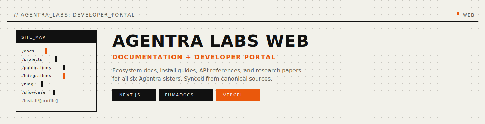

<p align="center">
  
</p>

<p align="center">
  <a href="https://agentralab-tech-web.vercel.app"></a>
  <a href="#stack"></a>
  <a href="#stack"></a>
  <a href="LICENSE"></a>
</p>

<p align="center">
  <strong>Documentation site and developer portal for the Agentra ecosystem.</strong>
</p>

<p align="center">
  <a href="#local-development">Dev</a> · <a href="#docs-sync">Docs Sync</a> · <a href="#pages">Pages</a> · <a href="#linked-repositories">Repos</a>
</p>

---

<a name="stack"></a>

## Stack

- **Next.js** App Router + TypeScript
- **Tailwind CSS** + Framer Motion
- **Fumadocs** MDX documentation engine
- **Vercel** deployment

<a name="local-development"></a>

## Local Development

```bash
pnpm install
pnpm dev             # http://localhost:3000
```

Build and verify:

```bash
pnpm docs:sync       # sync ecosystem docs from canonical sources
pnpm lint            # tsc --noEmit
pnpm build           # production build
```

<a name="docs-sync"></a>

## Docs Sync

Ecosystem documentation is generated from canonical sources in the sister repos and the monorepo. The sync pipeline ensures the web site always matches the source of truth.

```bash
pnpm docs:sync          # regenerate docs from canonical sources
pnpm docs:sync:check    # strict mode — fails if docs are out of sync
```

Canonical sources: sister `docs/public/` directories + monorepo `docs/`.

## Automated Blog Publishing

Blog entries are generated from GitHub release/commit signals and published automatically every 4-5 days.

```bash
pnpm lablog:generate     # generate from signals
pnpm lablog:release      # sync from GitHub releases
```

Workflow: `.github/workflows/lab-log-autopublish.yml`

<a name="pages"></a>

## Pages

| Route | Content |
|-------|---------|
| `/` | Home |
| `/projects` | Projects overview |
| `/publications` | Research papers |
| `/docs` | Documentation hub (all five sisters) |
| `/integrations` | MCP client integration guides |
| `/showcase` | Community showcase |
| `/blog` | Lab log / blog |
| `/feedback` | Feedback |
| `/channels` | Community channels |
| `/partners` | Partners |
| `/install/[target]/[profile]` | Install route (desktop/terminal/server) |

<a name="linked-repositories"></a>

## Linked Repositories

| Sister | Repository | Artifact |
|--------|-----------|----------|
| AgenticMemory | [agentralabs/agentic-memory](https://github.com/agentralabs/agentic-memory) | `.amem` |
| AgenticVision | [agentralabs/agentic-vision](https://github.com/agentralabs/agentic-vision) | `.avis` |
| AgenticCodebase | [agentralabs/agentic-codebase](https://github.com/agentralabs/agentic-codebase) | `.acb` |
| AgenticIdentity | [agentralabs/agentic-identity](https://github.com/agentralabs/agentic-identity) | `.aid` |
| AgenticTime | [agentralabs/agentic-time](https://github.com/agentralabs/agentic-time) | `.atime` |

---

<p align="center">
  Built by <a href="https://agentralab-tech-web.vercel.app">Agentra Labs</a>
</p>
